# AI推論 × チップ × モデル（発表スライド1枚分）

対象: UTokyo AI Hackathon 発表資料の「AI推論とチップ、モデルの関係」1枚。
数値はすべて開発機（Snapdragon X / Windows ARM64）でのローカル実測（2026-07-18）で、
移植可能な性能保証ではない。出典は
[hardware-runtime-findings.md](hardware-runtime-findings.md) と
[qnn-hand-model-quantization.md](qnn-hand-model-quantization.md)。

---

## 1. 一行メッセージ

> **同一のモデルを、CPU / GPU / NPU の3経路で走らせ、
> 「精度の基準」「量子化不要の高速化」「量子化を伴う最高速」を測って比較した。**

NPU は最速だが量子化が必要で、その精度はキャリブレーションデータの質で決まる。
それを実測で示せることが本プロジェクトの主張。

---

## 2. 使用モデル（正式名称）

| 段 | ファイル | 出自 | 入力 |
|---|---|---|---|
| ① Palm Detection | `palm_detection_mediapipe_2023feb.onnx` | OpenCV Zoo による MediaPipe Hands 系モデルの TFLite→ONNX 変換 | 192×192 NHWC float32 `[0,1]` |
| ② Hand Landmark | `handpose_estimation_mediapipe_2023feb.onnx` | 同上 | 224×224 NHWC float32 `[0,1]` |

配布元:
`huggingface.co/opencv/palm_detection_mediapipe` /
`huggingface.co/opencv/handpose_estimation_mediapipe`

②の出力契約:

```text
Identity    [1, 63]   21点 × xyz（画像座標）
Identity_1  [1, 1]    信頼度
Identity_2  [1, 1]    handedness
Identity_3  [1, 63]   21点 × xyz（world landmark）
```

NPU 用の量子化派生:

```text
palm_detection_qdq.onnx / hand_landmark_qdq.onnx
  W8A16  conv重み per-channel uint8 / 活性 per-tensor uint16
         MatMul/Gemm 重みは per-tensor（QNN 互換性のため）
         グラフ入出力は float32（Q/DQ 境界ノード）
```

> **アーキテクチャ・重みの出自は Google MediaPipe Hands、実際に使うファイルは
> OpenCV Zoo の ONNX 変換版。** Google は TFLite しか配布していないため。

---

## 3. 3経路の比較（スライドの主表）

| | **CPU EP** | **DirectML EP** | **QNN EP (HTP)** |
|---|---|---|---|
| 実行チップ | ARM64 CPU | Adreno GPU | **Hexagon NPU** |
| 数値精度 | float32 | float32 | **W8A16 量子化が必須** |
| 位置づけ | **精度の基準** | 量子化なしで高速化 | **最速** |
| Palm 推論 | 7.41 ms | 約 3.3 ms | **1.53 ms**（4.8x） |
| Landmark 推論 | 7.78 ms | 約 3.2–3.3 ms | **1.20 ms**（6.5x） |
| End-to-End | 9.92 ms | — | **3.70 ms**（2.7x） |
| 前処理との接続 | ステージング読み戻し | **GPU 常駐可能** | ステージング読み戻し |
| 将来性 | 互換性の最終防衛線 | **カメラ→表示まで全 GPU 常駐** | 量子化精度の作り込み次第 |

CPU フォールバックは DirectML / QNN とも**意図的に無効化**している。
未対応ノードを CPU が黙って肩代わりしないので、上記の値は純粋なそのチップ上の実行時間。

---

## 4. GPU: 量子化不要 + 全 GPU 常駐の可能性

DirectML の価値は速度そのものより**経路の一貫性**にある。

```text
Media Foundation → D3D11 テクスチャ（CPUに落とさない）
  → D3D12 コンピュートで前処理（向き補正・ROI・正規化・NHWC）
  → DirectML で推論（同一 D3D12 デバイス / 別 compute キュー）
  → D3D11/Direct2D で描画
```

**カメラから表示まで CPU リードバックがゼロ**になる。実装済みで
`RYOIKI_DIRECTML_GPU_TENSOR=1` により opt-in で有効化できる。
量子化しないので精度は float32 のまま。

Qualcomm ドライバ上の制約として、direct キューと compute キューの分離が必須
（単一キュー共有は約2秒の `Present` ストールを発生させた）。

---

## 5. NPU: 最速だが量子化が必要 — 精度はキャリブレーションで決まる

**ここがスライドの山場。** 同じ W8A16 でも、量子化の粒度とキャリブレーション
データの質で精度が一桁変わることを実測している。

### 5.1 改善前後（1,000テンソルのホールドアウト、float32 モデルとの差分）

| 指標 | 初回 W8A16<br/>per-tensor / 校正660 | 改善版 W8A16<br/>**per-channel / 校正3,950** |
|---|---:|---:|
| Landmark XY 平均誤差 | 3.63 px | **0.553 px** |
| Landmark XY p95 | 7.70 px | **1.32 px** |
| 手の存在判定の反転率 | 0.80% | **0.00%** |
| handedness 判定の反転率 | 0.00% | 0.00% |
| Palm 検出判定の反転率 | — | **0.00%** |

**Landmark 誤差を 3.63 px → 0.553 px（約 1/6.6）に低減。**

### 5.2 何が効いたか

1. **量子化粒度**: conv 重みを per-tensor → **per-channel uint8** に
2. **キャリブレーションデータの拡充**: hand 660 → **3,950** テンソル

そして2番目には、このシステム固有の落とし穴があった。

> **ROI ループバックが働いている限り、パーム検出はほとんど実行されない。**
> 通常動作でキャリブレーションを収集すると palm のデータが極端に不足する
> （初回は palm 36テンソルしか集まらなかった）。

対策として**周期パーム収集モード**（5処理フレームごとに検出器を実行し、その出力は
トラッキング ROI に反映せず破棄）を実装し、palm を 566 テンソルまで拡充した。

これは「MediaPipe 的トラッキング構造を理解していないと踏む罠」であり、
NPU 活用の実務的な知見として話す価値がある。

### 5.3 精度を上げても速度は落ちていない

改善版 W8A16 モデルも CPU フォールバックなしで HTP セッションを生成し、
hand landmark p50 **1.613 ms** / palm detection p50 **2.515 ms** で実行された。

---

## 6. 正直に言うべき限界（質疑対策）

スライドには小さく、口頭では必ず触れる。

```text
・全数値は float32 モデルとの差分であり、人手アノテーションの真値との比較ではない
・palm のホールドアウトは7サンプルのみ。recall の結論は出せない
・world landmark（Identity_3）の手首相対誤差は初回モデルで 33% / p95 66.5% と大きく、
  3Dカーソル・CAD 用途には不足だった。改善版での再評価は未実施
・ORT は 16個の bias が int32 量子化範囲を超えると警告し続けている（既知の制限）
・推論時間は Run() のホスト側 wall time。GPU/NPU のチップ上純粋演算時間ではない
・HTP はセッション生成時に 20 フレームの知覚ドロップを記録（起動時のみ、定常では増えない）
```

**「NPU で動いています」ではなく「NPU で 4.8〜6.5倍速く、量子化精度をここまで詰めた。
残る課題はこれ」**と言うのが、この計装を持っているプロジェクトの正しい話し方。

---

## 7. 図（確定版・3枚構成）

3枚は別々の問いに答える。1枚に混ぜない。

```text
図1  推論グラフ          「演算をどう進めるか」          グラフ構造が主役
図2  推論アーキテクチャ  「推論はどこで動くか」          選択肢の並列が主役
図3  メモリ管理          「データはどこにあり誰が持つか」 所在と所有が主役
```

カメラ取得・表示・下流機能の**概観は「システムアーキテクチャ」のスライドで済んでいる**。
ここで再掲すると重複になるため、図1 は MediaPipe 準拠グラフの内部だけを扱う。

### 図1: 推論グラフ

MediaPipe Hands 準拠グラフの内部だけを描く。カメラ取得・表示・計測・認識・
CAD は範囲外（システムアーキテクチャのスライドで既出）。

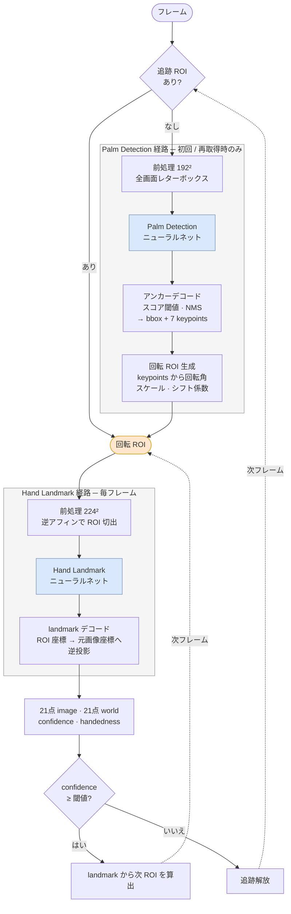

**この図の主張**

```text
青の2ノードだけがニューラルネット。それ以外はすべて決定的な幾何演算
  → 「モデルを呼ぶ」ことと「グラフを回す」ことは別の仕事

推論は2段（palm 192² / hand 224²）で、入力サイズも役割も異なる

ROI は palm 由来と landmark 由来の2つの入り口を持つ
  landmark 由来の ROI ループバックが回っている限り palm 検出は走らない
  → だからキャリブレーションで palm データが不足した（5.2 に接続）

追跡の継続/解放は landmark モデルの confidence が決める
  → 量子化で presence 判定が反転すると、1フレームの誤りが
    ROI ループを壊して以降のフレームに波及する（6節の限界に接続）
```

グラフ定義の出典は MediaPipe の以下のファイル。挙動はこれを仕様として
C++ で実装しており、MediaPipe の C++ ランタイムは使用していない。

```text
hand_landmark_tracking_cpu.pbtxt
palm_detection_detection_to_roi.pbtxt
hand_landmark_landmarks_to_roi.pbtxt
```

### 図2: 推論アーキテクチャ

図1の `推論` ブロックだけを展開する。ハードウェア名を主、EP を従に置く。

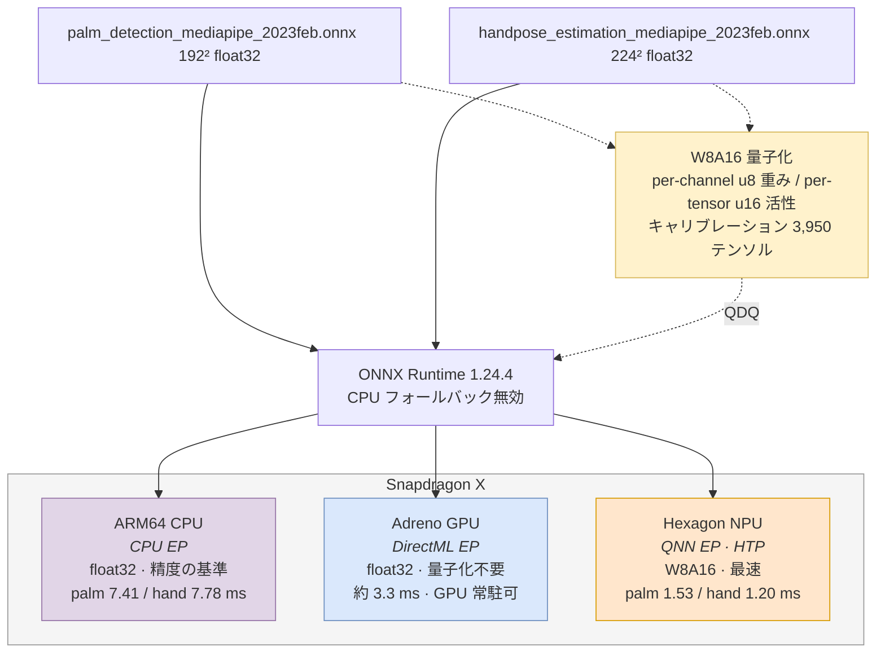

**ロゴの置き場所**: `ONNX Runtime` ブロックの脇に ONNX Runtime ロゴ、`Snapdragon X` の枠内に
Snapdragon ロゴ。**EP 行にはロゴを置かない**（QNN にロゴが存在せず、1つだけ空いて不揃いになるため）。

**この図の主張**

```text
1つのモデルを 3チップで走らせて比較した
NPU は最速だが量子化が必要（点線の経路）
CPU フォールバック無効 = 数値がそのチップ上の実行時間であることの保証
```

### 図3: メモリ管理

他チームが持っていない切り口。フル解像度の画素が GPU レーンから出ないことを見せる。

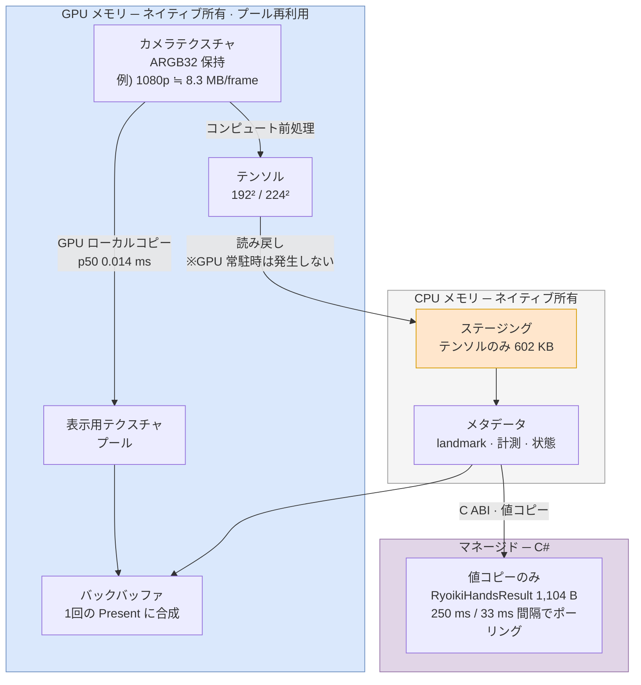

**この図に添える数字（3桁の縮約）**

| 段 | サイズ | 所在 |
|---|---:|---|
| カメラフレーム（例 1920×1080 ARGB32） | 約 **8.3 MB** | GPU に留まる |
| モデルテンソル（224×224×3×float32） | **602 KB** | ステージングを通る |
| C ABI 通過（`RyoikiHandsResult`） | **1,104 B** | C# へ値コピー |

> **カメラ1フレーム 8.3 MB に対し、マネージド側へ渡るのは 1.1 KB。約 1/7,500。**

`1,104` はヘッダの `static_assert` で保証された確定値。「映像は1バイトも外に出ない」の定量版であり、
プライバシーと性能の主張を同時に支える。

**補足で言えること**

```text
毎フレームの新規確保をしない        FramePool / TensorBuffer で再利用
バッファごとに所在が型で明示される  MemoryLocation（Cpu / Gpu）
表示用コピーは意図的               同一テクスチャ同時所有によるストール回避
                                    p50 0.014 ms は 3〜5 ms の推論に隠れる
破棄を隠さず数えて公開する          frame_pool_dropped_frames
                                    perception_dropped_frames
履歴は有界                          HandTopologyHistory 64 / OrderedHandEventRing
C# はネイティブポインタを保持しない
```

---

## 8. 図案アーカイブ（検討した代替案）

### 案A: 3レーン比較（推奨）

1枚に「1モデル → 3経路 → 3チップ」と数値が同時に入る。

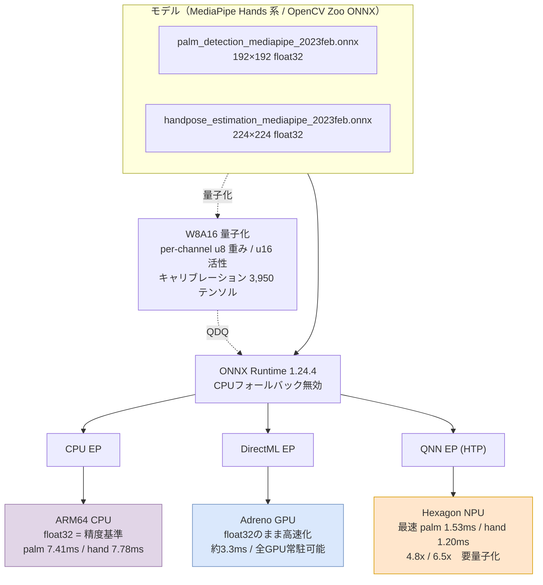

### 案B: 縦積み（シンプル・文字が大きく取れる）

会場後方から読めることを優先する場合。

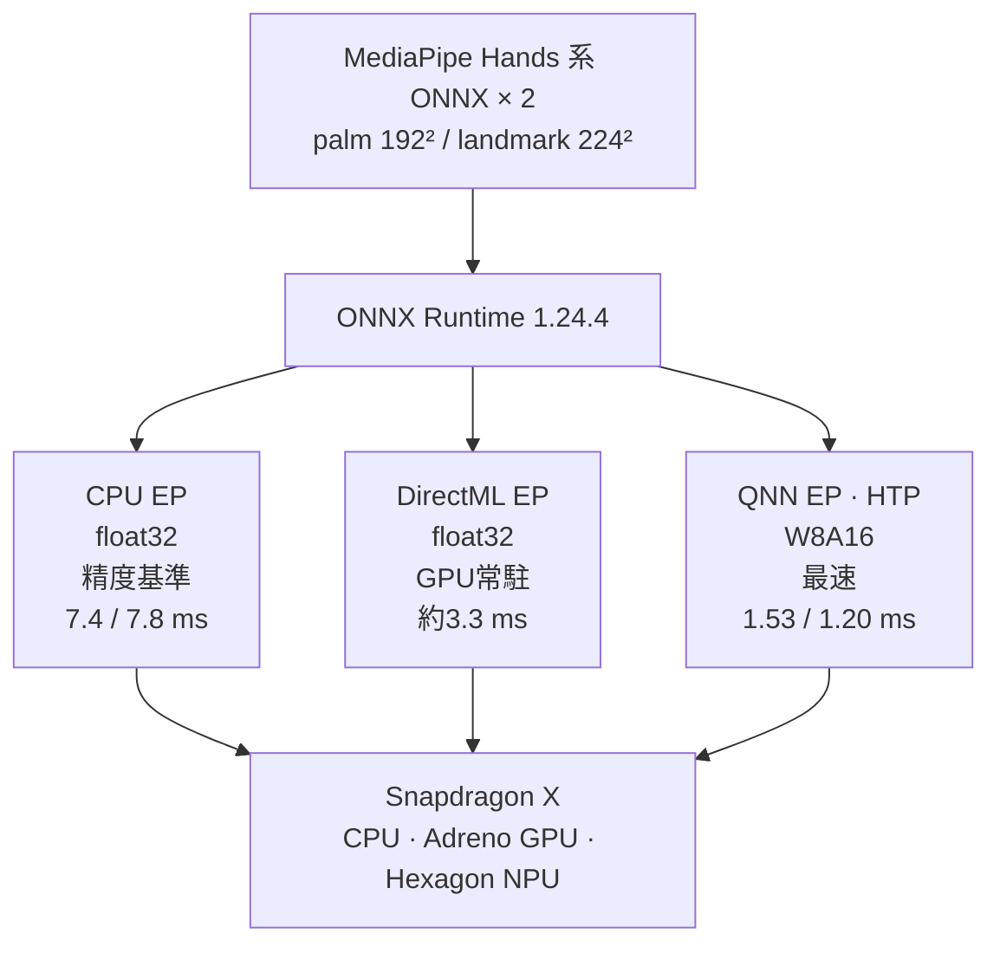

### 案C: 量子化ワークフロー（キャリブレーションの物語を見せる）

5節を主役にする場合。案A/Bと併用して小さく添えるのも良い。

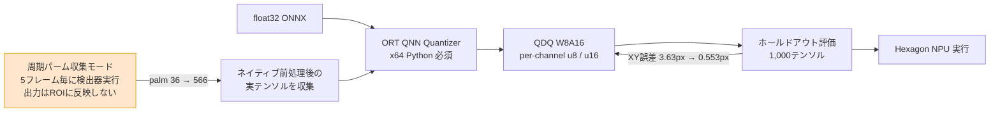

### 案D: 精度×速度のポジショニング

トレードオフを一目で見せたい場合。**`quadrantChart` は対応していない
描画環境があるため、事前にレンダリング確認すること。**

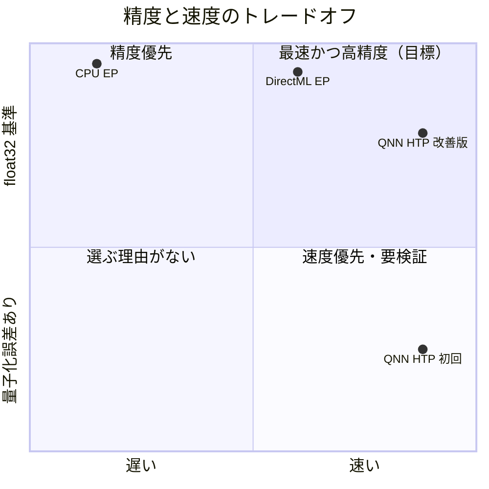

改善版が左下から右上へ動いた、という矢印を手描きで足すと物語になる。

---

## 7.5 パイプライン込みの図案

「ランタイムに EP が3つぶら下がる」図では見えないものが2つある。

1. **ROI ループバック** — トラッキング中はパーム検出を飛ばす。だから palm の
   キャリブレーションデータが集まらなかった（5.2）。この構造は図で見せた方が早い
2. **テンソルが GPU から CPU に戻る位置が EP ごとに違う** — ここが
   「GPU は全 GPU 常駐が可能」の技術的根拠

実装上の分岐は `ryoiki_native.cpp` の1箇所:

```text
RYOIKI_DIRECTML_GPU_TENSOR=1 かつ DirectML ビルド
  → D3d12HandGeometryProcessor   入力 GPU / 出力 GPU（読み戻しなし）
それ以外（CPU EP / QNN / 通常の DirectML）
  → D3d11HandGeometryProcessor   入力 GPU / 出力 CPU（ステージング読み戻し）
```

### 案E: パイプライン全体 + EP 分岐（スライド推奨）

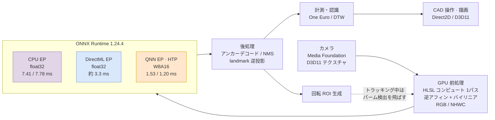

### 案F: メモリ所在で色分け（技術的に最も強い）

同じパイプラインを「データがどこにあるか」で塗り分ける。DirectML GPU 常駐経路だけ
CPU に戻らないことが一目で分かる。

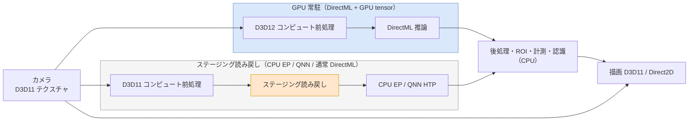

オレンジの「ステージング読み戻し」が、GPU 常駐経路にだけ存在しない。
**「将来的に全 GPU バックエンド実行の可能性」の根拠がこの1ブロックの有無**になる。

### 案G: 表示/知覚の2ブランチを含む完全版

遅延とリアルタイム性の主張までする場合。情報量が多いので、口頭で追える構成に
なっているか確認してから使う。

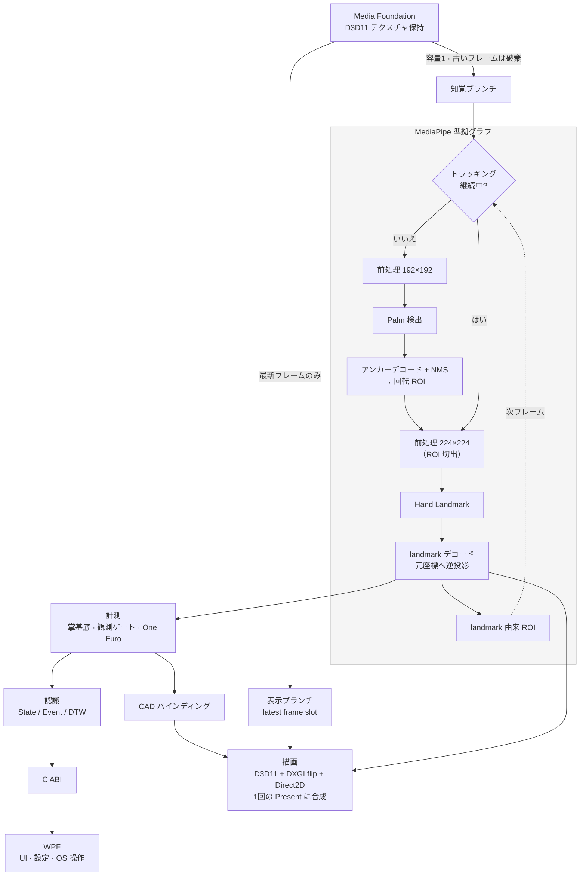

この図の主張は3つ。

```text
表示は推論を待たない（29.7 / 30.0 fps）
知覚は容量1で古いフレームを溜めない
ROI ループバックにより通常はパーム検出が走らない
  → だからキャリブレーションで palm データが不足した（5.2 に接続）
```

---

## 9. スライド構成

```text
スライド1  パイプライン
             図1 ＋「表示は推論を待たない / ROIループバック」

スライド2  AI推論 × チップ × モデル  ← ハッカソンの主題
             上段  使用モデル（正式名称・入出力）
             中段  図2
             下段  精度改善の before / after 表（5.1）

スライド3  メモリ管理
             図3 ＋ 8.3 MB → 602 KB → 1.1 KB の縮約表
```

1枚しか使えない場合は**スライド2**。3枚使えるなら図3を必ず入れる
（他チームと差が出る切り口のため）。

口頭で必ず触れる:

```text
ROI ループバックのせいで palm のキャリブレーションデータが集まらず、
周期パーム収集モードを作った話（5.2）
残る限界（6節）
```

代替図案が必要な場合は §8 のアーカイブを参照。
とくに **案F**（GPU 常駐 vs ステージング読み戻し）は、
「GPU は将来 全 GPU 実行できる」と述べた直後の補足として効く。

---

## 10. 付録: メモリ管理 詳細図（質疑・バックアップスライド用）

スライド本編の図3は圧縮版。ここでは実装のクラスと制御構造をそのまま示す。
実装の所在は `src/Buffers/`, `src/Pipeline/`, `src/Rendering/`。
方針の正典は [native-frame-memory-roadmap.md](native-frame-memory-roadmap.md)。

### 10.1 統合図: 所有・フレームワーク・経路

C++ 側の所有構造、フレームワーク間の受け渡し機構、3つの消費経路を1枚に統合したもの。
機構名の詳細と同期プロトコルは §10.3 に分解してある。

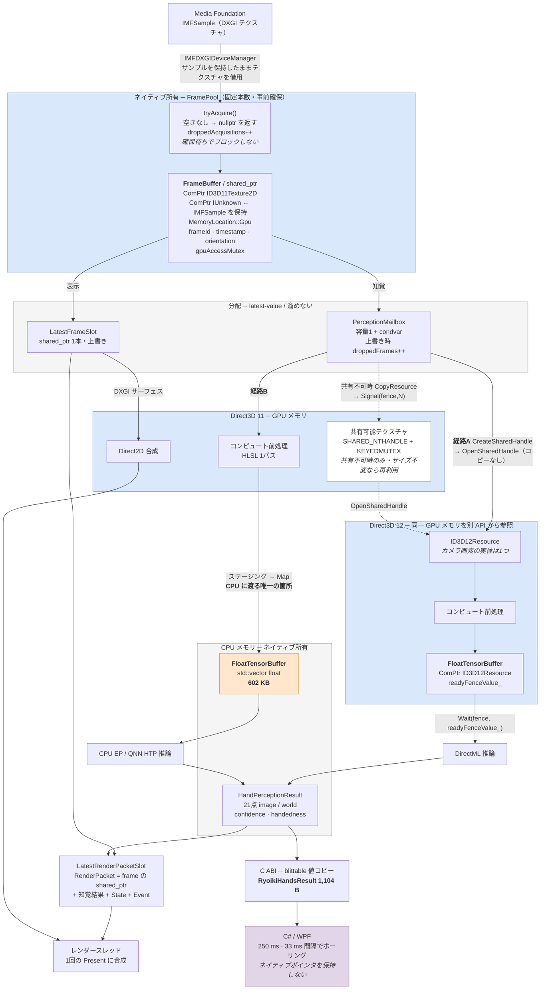

**読み方**

```text
青い枠 = GPU メモリ。カメラ画素はこの中だけに存在する
灰色枠 = CPU メモリ。入ってくるのはモデルサイズのテンソルと小さなメタデータのみ
オレンジ = CPU へ渡る唯一の箇所（602 KB）
紫 = マネージド。1,104 B の値コピーのみ

実線 = 常に通る経路
点線 = 共有不可テクスチャのフォールバック（GPU 内コピー1回）

経路A（DirectML）  読み戻しが発生しない
経路B（CPU / QNN） ステージング経由でモデルサイズだけ読み戻す
表示経路           GPU 内で完結し Direct2D がそのまま合成する
```

**この1枚で言えること**

```text
所有は FrameBuffer 1つに集約され、shared_ptr の参照が消えるとプールへ戻る
IMFSample を ComPtr で握ることで、コピーせずテクスチャ寿命を保証している
カメラ画素の実体は1つ。D3D11 と D3D12 は同じメモリを別 API から見ているだけ
背圧はドロップで吸収し、数を計測して公開する（確保待ちで遅延を作らない）
フェンスは GPU キュー上で解決されるのでホストスレッドはブロックしない
```

### 10.2 バッファのライフサイクル

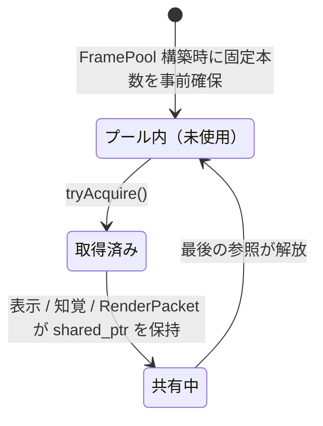

空きが無いときの `tryAcquire()` は **nullptr を返してフレームを落とす**。
確保待ちでブロックしないため、混雑時に遅延ではなくドロップとして現れる。
落とした数は `droppedAcquisitions()` として保持され、
`frame_pool_dropped_frames` で ABI に公開される。

### 10.3 フレームワーク間のメモリ受け渡し

実装は `src/Runtime/directml_runtime.cpp`。4つのフレームワーク
（Media Foundation / Direct3D 11 / Direct3D 12 / DirectML）が
同じ画素を共有するための機構と、その同期を示す。

#### 受け渡しの機構

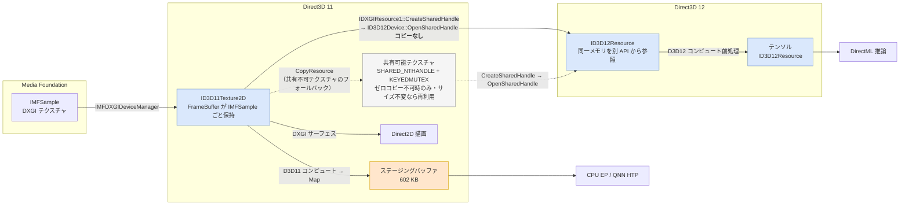

`tryOpenD3d11Texture()` はまず**コピーなしの共有**を試み、
成功可否を診断文字列（`"zero-copy D3D12 open succeeded."` / 失敗理由）に記録する。
Media Foundation のテクスチャが共有可能フラグ付きで作られていない場合のみ、
`copyCameraToSharedTexture()` が共有可能テクスチャを1枚作って `CopyResource` する。
このテクスチャは解像度が変わらない限り再利用され、`frameId` が同じ間は再コピーしない。

#### 同期プロトコル（共有フェンス）

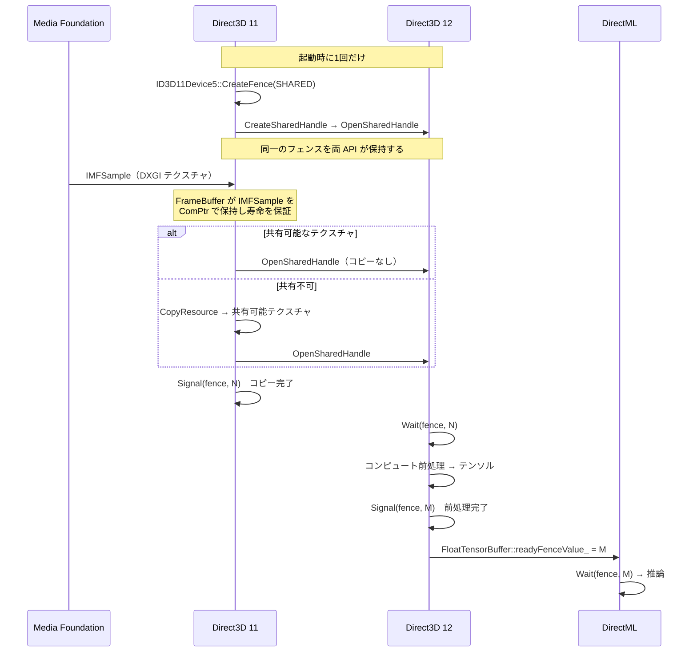

要点は **CPU が待たないこと**。`Signal` / `Wait` はすべて GPU キュー上で解決され、
ホストスレッドはブロックしない。フェンス値は `nextFenceValue()` の単調増加で、
テンソルバッファがその値を運ぶ（`readyFenceValue_`）。

#### D3D11On12 の場合

`d3d11Device->isD3d11On12()` が真のときは、D3D12 デバイスが既に存在するため
上記の共有手続きを行わず、`d3d11Device->d3d12Device()` をそのまま使う。
カメラテクスチャは `UnwrapUnderlyingResource`（compute キューを渡す）で D3D12 側に貸し出し、
`ReturnUnderlyingResource`（前処理完了フェンスを渡す）で返却する。

#### まとめ

| 境界 | 機構 | コピー |
|---|---|---|
| Media Foundation → D3D11 | `IMFDXGIDeviceManager`、サンプルを ComPtr で保持 | なし |
| D3D11 → D3D12（通常） | `IDXGIResource1::CreateSharedHandle` → `OpenSharedHandle` | **なし** |
| D3D11 → D3D12（フォールバック） | 共有可能テクスチャへ `CopyResource` | GPU 内 1回 |
| D3D11 ⇄ D3D12（On12 時） | `UnwrapUnderlyingResource` / `ReturnUnderlyingResource` | なし |
| D3D12 → DirectML | 同一デバイス上の `ID3D12Resource` | なし |
| D3D11 → CPU EP / QNN | コンピュート → ステージング → `Map` | **602 KB のみ** |
| D3D11 → Direct2D | DXGI サーフェス | なし |
| ネイティブ → C# | blittable 値コピー | **1,104 B** |

フル解像度の画素が CPU に渡る経路は**存在しない**。

### 10.4 設計上の要点（質疑で使う）

| 論点 | 実装 |
|---|---|
| **カメラテクスチャの寿命** | `FrameBuffer` が `ID3D11Texture2D` に加えて **Media Foundation サンプル本体を `ComPtr IUnknown` で保持**する。サンプルを生かしたままテクスチャを借用するので、コピーせずに安全に保持できる |
| **所在を型で表す** | `MemoryLocation`（`Cpu` / `Gpu` / `Npu` / `Shared`）。将来の配置まで型に用意してある |
| **毎フレームの確保をしない** | `FramePool` が固定本数を事前確保。`FloatTensorBuffer` も形状固定で再利用 |
| **背圧はドロップで吸収** | `tryAcquire()` は非ブロッキング。`PerceptionMailbox` は容量1で上書き。**遅延を溜めない代わりに落とす**という明示的な選択 |
| **落とした数を隠さない** | `droppedAcquisitions()` / `droppedFrames()` → `frame_pool_dropped_frames` / `perception_dropped_frames` |
| **GPU 完了の同期** | `FloatTensorBuffer::readyFenceValue_` を DirectML 側が待つ。CPU 側でブロックしない |
| **キュー分離** | direct（キャプチャ・表示）と compute（テンソル生成・DirectML）を分ける。単一キュー共有は約2秒の `Present` ストールを発生させた実測がある |
| **表示コピーは意図的** | 同一テクスチャの同時所有によるストール回避。GPU 内コピーで p50 0.014 ms / p95 1.839 ms。3〜5 ms の推論に隠れる |
| **C# は所有しない** | blittable 構造体の値コピーのみ。ネイティブポインタを保持せず、`abi_version` と `struct_size` を毎回検証 |
| **有界な履歴** | `HandTopologyHistory` は最大64サンプル、`OrderedHandEventRing` は有界リング。無制限に伸びる保持を持たない |

### 10.5 不変条件（`native-frame-memory-roadmap.md` より）

```text
VisionPacket は全消費者が解放するまでフレームを所有または貸与する
表示と知覚は容量1 / latest-value 配信
palm・hand のメタデータは元の frameId を特定できる
向きはメタデータのまま。回転済みフル解像度コピーを作らない
結果は論理的な正立座標で保持する
C# はコピーされたメタデータのみを受け取り、ネイティブのフレーム／テンソルを所有しない
ハードウェア配置はキャプチャと geometry / model-runner インタフェースの背後に隠す
```
