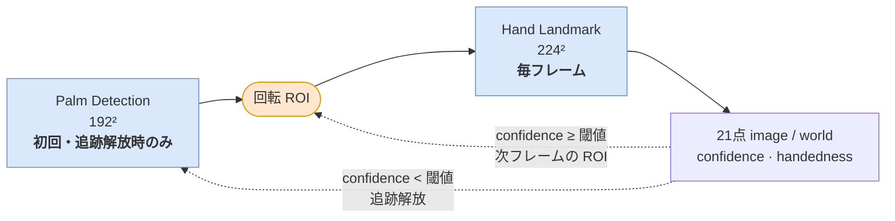
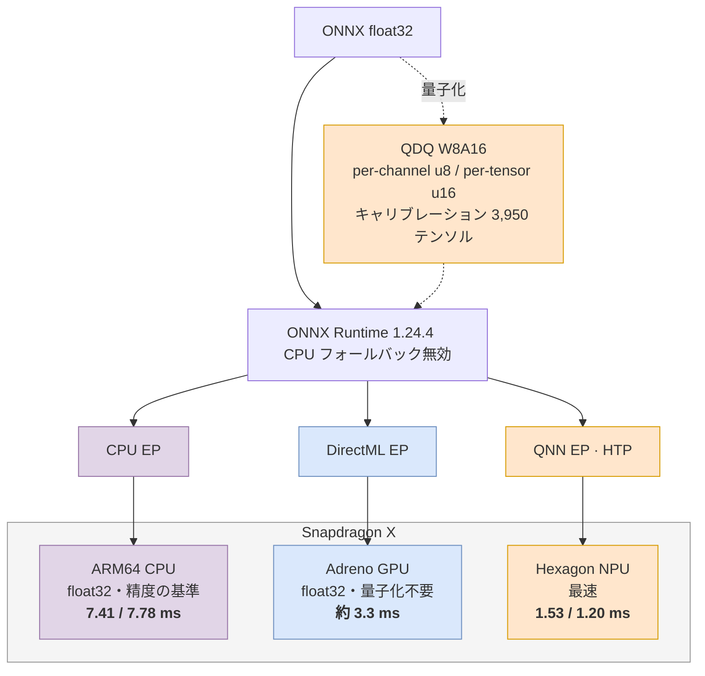
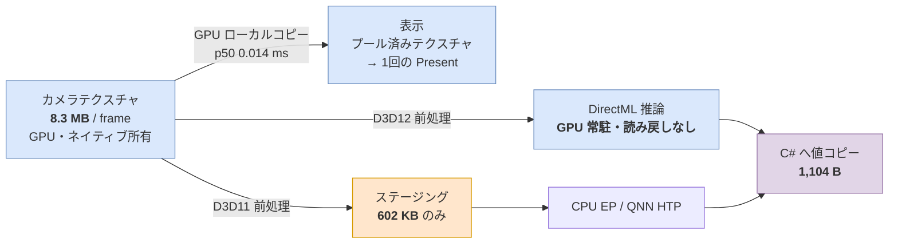

# スライド: AI推論 × チップ × モデル（1枚）

3図＋数値を1枚に収める仕様。冗長な中間処理（デコード・NMS・逆投影など、
入出力契約から自明なもの）はモデルブロックに畳んである。

## レイアウト

図1から3つを縦に配置し、スライドを縦に3分割した形でそれぞれの図を配置する。
情報密度を高くするが、必要な情報を必要なだけ書けばよく、説明的にならず事実の羅列を心がける。

## 使用モデル（スライド最上部に1行）

```text
palm_detection_mediapipe_2023feb.onnx        192×192  float32
handpose_estimation_mediapipe_2023feb.onnx   224×224  float32
   MediaPipe Hands 系 / OpenCV Zoo による ONNX 変換版
   NPU 用に QDQ 量子化（W8A16）
```

---

## 図1: 推論グラフ



**言うこと（20秒）**

```text
ニューラルネットは2つだけ。あとは ROI を回すループ。
追跡が続く限り Palm Detection は走らない。
ループを続けるか切るかは landmark モデルの confidence が決める。
```

**この図が後で効く場所**

```text
Palm が走らない → キャリブレーション用の palm データが集まらなかった
confidence が判定 → 量子化で presence が1回反転するとループ全体が壊れる
```

---

## 図2: どのチップで動くか

ランタイム → EP → チップの**3層を潰さない**。EP 層があることで
「1つのランタイムから差し替えでチップが変わる」が図で成立する。



オレンジの3ブロック（量子化 → QNN EP → Hexagon NPU）が視覚的に繋がるので、
**「量子化が要るのは NPU 経路だけ」**が色で読める。

**キャプション（図の下に小さく）**

```text
数値は palm / hand の推論時間 中央値（実カメラ連続計測・2026-07-18）
End-to-End  CPU 9.92 ms → NPU 3.70 ms（2.7x）
NPU は CPU 比 palm 4.8x / hand 6.5x
CPU フォールバック無効 ＝ そのチップ上の実行時間であることの保証
```

**言うこと（30秒）**

```text
同じモデルを1つのランタイムから3つのチップへ流し分けている。
CPU は精度の基準、GPU は量子化なしで倍速、NPU は最速だが量子化が要る。
GPU は前処理から描画まで同じ D3D12/D3D11 上にあるので、
将来は全 GPU 常駐にできる。
```

---

## 図3: データはどこにあるか

1枚のカメラテクスチャから**3つの経路**が出る。経路ごとに扱いが違うことが主張。



**キャプション（図の下に小さく）**

```text
青 = GPU に留まる／オレンジ = CPU へ渡る唯一の箇所（モデルサイズのみ）
表示コピーは意図的：同一テクスチャの同時所有によるストールを回避
                    p50 0.014 ms は 3〜5 ms の推論に隠れる
1,104 B は ABI ヘッダの static_assert で保証された確定値
全バッファがネイティブ所有・プール再利用（毎フレームの新規確保なし）
```

**言うこと（30秒）**

```text
カメラ1枚のテクスチャから3経路。どの経路もフル解像度の画素を CPU に落とさない。
表示は GPU 内コピーだけ。DirectML は読み戻しすら発生しない。
CPU と NPU だけがモデルサイズのテンソルを1回受け取る。
C# に渡るのは 1 KB。8.3 MB に対して約 1/7,500。
```

---

## 下段: 量子化精度（表を1つだけ）

NPU の「量子化が必要」を主張したら、必ずこの表で回収する。

| | 初回 W8A16 | 改善版 W8A16 |
|---|---:|---:|
| キャリブレーション | 660 テンソル | **3,950 テンソル** |
| 量子化粒度 | per-tensor | **per-channel** |
| Landmark XY 平均誤差 | 3.63 px | **0.553 px** |
| 手の存在判定 反転率 | 0.80% | **0.00%** |

**言うこと（20秒）**

```text
NPU は量子化しないと動かない。最初は誤差 3.63 px で使い物にならなかった。
per-channel 量子化とキャリブレーションデータ拡充で 0.553 px まで下げた。
速度は落ちていない。
```

---

## 質疑用（スライドには載せない）

```text
・数値は float32 モデルとの差分であり、人手アノテーションの真値ではない
・palm のホールドアウトは 7 サンプルのみ。recall の結論は出せない
・world landmark の手首相対誤差は初回モデルで 33% と大きく、改善版は再評価未実施
・推論時間は Run() のホスト側 wall time。チップ上の純粋演算時間ではない
・palm のキャリブレーションデータが不足したのは ROI ループバックのため。
  5 フレーム間隔の周期パーム収集モードを作って 36 → 566 テンソルに拡充した
・QNN GPU を使わないのは、Adreno への経路を DirectML が押さえており、
  QNN GPU は OpenCL ベースで D3D 常駐パイプラインに繋がらないため
```

出典: [hardware-runtime-findings.md](hardware-runtime-findings.md) /
[qnn-hand-model-quantization.md](qnn-hand-model-quantization.md)（いずれも 2026-07-18 の
開発機ローカル実測。移植可能な性能保証ではない）
