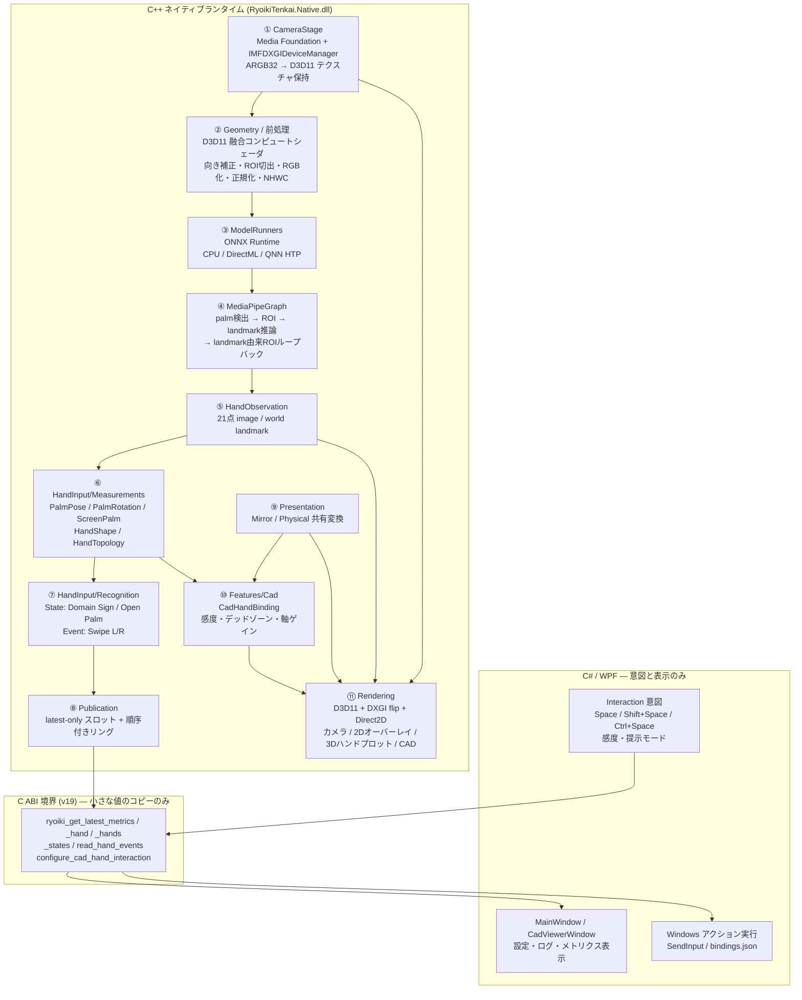
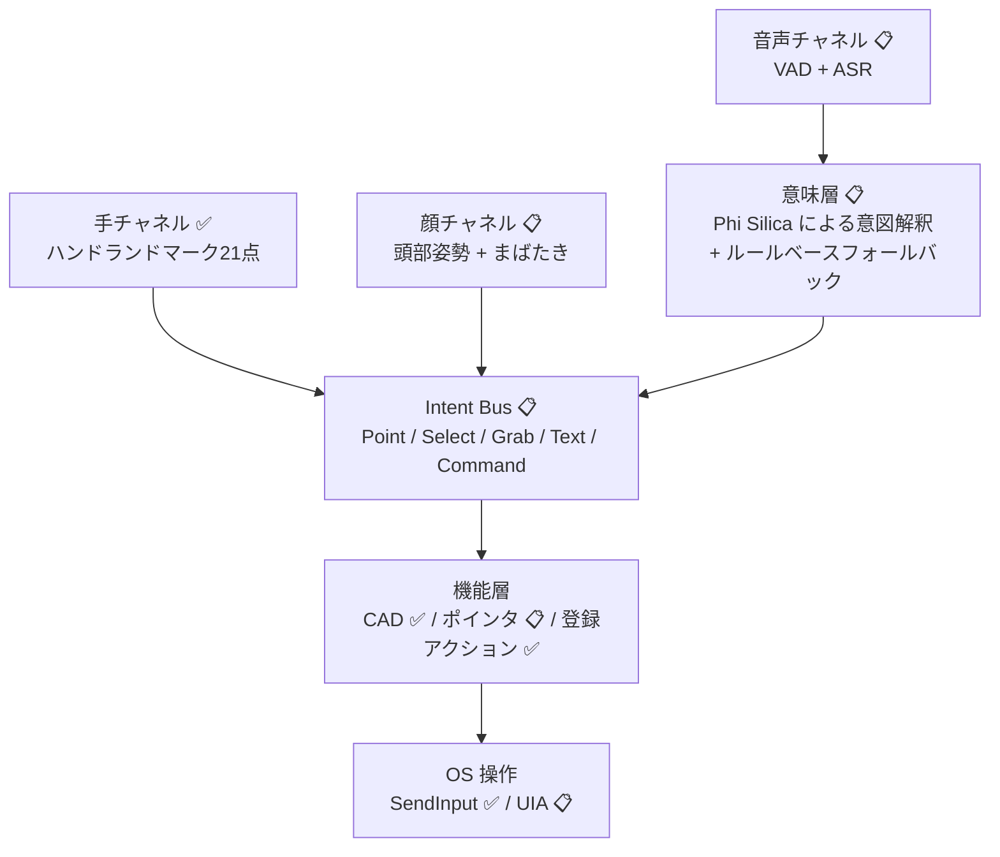

# システムアーキテクチャ（UTokyo AI Hackathon 発表用）

対象: 2026-08-01 UTokyo AI Hackathon 発表資料「システムアーキテクチャ」節。
アプリ名: **RyoikiTenkai**（領域展開）

本書は発表用にアーキテクチャを一枚にまとめたもの。設計上の正典は以下であり、
本書はそれらの要約と図示に徹する。

- [hand-input-architecture.md](hand-input-architecture.md) — 知覚とアプリ機能の境界（正典）
- [native-vision-runtime.md](native-vision-runtime.md) — C ABI 契約（正典）
- [gesture-recognition-framework.md](gesture-recognition-framework.md) — 認識層
- [hardware-runtime-findings.md](hardware-runtime-findings.md) — 実測値
- [hackathon-demo-design.md](hackathon-demo-design.md) — プロダクト構想（将来像）

**凡例**: 各項目に実装状態を明記する。

| 記号 | 意味 |
|---|---|
| ✅ | 実装済み・動作確認済み |
| 🚧 | 実装中（本セッション時点で未コミットの作業を含む） |
| 📋 | 未実装（設計済み／ロードマップ） |

---

## 1. 一行で言うと

> **カメラ映像からの手の知覚を C++/NPU 側に完全に閉じ込め、C# には「意図」と「小さな数値」しか渡さない、ローカル完結のハンド入力ランタイム。**

クラウド送信ゼロ。映像は 1 バイトもプロセス外に出ない。

---

## 2. レイヤ全体図



### ASCII 版（スライド貼り付け用）

```text
┌──────────────────────────────────────────────────────────────┐
│ C# / WPF          UI・設定・ログ・メトリクス表示               │
│                   操作意図（キーゲート）・OSアクション実行      │
├──────────────────────────────────────────────────────────────┤
│ C ABI v19         小さな値のコピーのみ / 画像・テンソルは渡さない│
│                   latest-only ポーリング + 順序付きイベント読取 │
├──────────────────────────────────────────────────────────────┤
│ ⑩ Feature Binding      CadHandBinding（感度・軸・クランプ）    │
│ ⑨ Presentation         Mirror / Physical 共有座標ポリシー      │
│ ⑧ Publication          latest スロット / 順序付きリング        │
│ ⑦ Recognition          State（Open Palm 等）/ Event（Swipe）   │
│ ⑥ Measurement          掌姿勢・相対回転・画面中心・指トポロジ  │
│ ⑤ Observation          21点 image/world landmark + 妥当性      │
│ ④ MediaPipe-like Graph palm→ROI→landmark→ROIループバック      │
│ ③ ModelRunners         ORT: CPU / DirectML / QNN HTP          │
│ ② Geometry             GPU 融合シェーダ（向き/ROI/正規化/NHWC）│
│ ① CameraStage          Media Foundation → D3D11 テクスチャ保持 │
│ ⑪ Rendering            D3D11/DXGI flip/Direct2D（唯一の表示路）│
└──────────────────────────────────────────────────────────────┘
```

---

## 3. アーキテクチャの中心思想（発表で強調すべき3点）

### 3.1 「重い視覚処理は C# に置かない」✅

C# が持つのは UI・設定・ログ・意図・OS アクションのみ。カメラバッファ、テンソル、
推論、描画はすべて C++ 側が所有する。C# は毎フレーム 21 点のランドマークを再処理
しない。

**効果**: GC 圧・マーシャリング・UI スレッドブロッキングを構造的に排除。

### 3.2 「MediaPipe を知覚サブグラフとして扱う」✅

ROI ループバックを外部ステージに分解せず、`hand_landmark_tracking_cpu.pbtxt` 等の
公式グラフ定義を真実の源として内部に閉じ込める。外側のパイプラインはフレーム流・
メトリクス・ハードウェア配置のみを担当する。

**効果**: トラッキング品質の劣化要因をグラフ内部に限定できる。

### 3.3 「Observation → Measurement → Recognition → Interaction → Command」✅

技術（カメラ・モデル）とアプリ機能（CAD 操作）を、**型付きの事実**で分離する。

```text
Observation   1フレームの知覚結果（意味を持たない）
Measurement   掌の回転、ピンチ距離などのタスク中立な物理量
Recognition   Open Palm 継続中（State）/ 左スワイプ発生（Event）
Interaction   捕捉・参照・サスペンド（ポインタキャプチャ相当）
Command       CAD orbit / 前ページへ
```

**効果**: カメラやモデルを差し替えても CAD 側は変わらず、CAD の感度カーブを変えても
知覚は変わらない。

---

## 4. 並行性とキュー方針 ✅

リアルタイム対話性を「全フレーム処理」より優先する。

```text
表示パス      最新フレームのみ（latest-only）
知覚パス      容量1・古いフレームは破棄
メタデータ    最新値のみ
Event         順序付きリング + 呼び出し側カーソル（取りこぼし禁止）
```

スレッド構成:

| スレッド | 責務 |
|---|---|
| カメラスレッド | Media Foundation サンプル取得、テクスチャ保持 |
| 知覚ワーカー | 前処理 → 推論 → グラフ → 計測 → 認識 |
| レンダースレッド | 子 HWND への合成と単一 Present |
| WPF UI スレッド | 小さな値のポーリングと表示のみ |

**設計上の要点**: DirectML GPU パスでは、キャプチャが表示フレームを知覚メタデータと
独立に公開する。推論がプレビュー更新をブロックしない。

---

## 5. メモリ所有権 ✅

| 対象 | 所有者 | 備考 |
|---|---|---|
| カメラ画像バッファ | C++ | D3D11 テクスチャとして保持、CPU リードバックなし |
| テンソルバッファ | C++ | モデルサイズのみステージングで受け渡し |
| メトリクス／計測値 | C# にコピー | blittable な値構造体、ポインタ非公開 |
| ランドマーク | C++ が保持、C# はコピー取得 | 高頻度処理は C++ 側 |

C ABI は `extern "C"` + `__declspec(dllexport)`、C++ 例外は境界を越えない。
すべての構造体は `abi_version` と `struct_size` を持ち、C# 側が毎回検証する。

---

## 6. ハードウェアランタイム（Qualcomm / Microsoft 活用）

### 6.1 実行プロバイダの分離 ✅

MediaPipe 相当グラフは `IHandModelRunner` 経由でしかモデルを呼ばない。グラフは
CPU / DirectML / QNN のどれで動いているかを知らない。

```text
CPU EP        互換性・数値の基準（常に動作可能）
DirectML EP   GPU 常駐前処理＋推論（別ビルド構成）
QNN HTP EP    Hexagon NPU、量子化 QDQ モデル（別ビルド構成）
```

**フォールバックは意図的に無効化**している。ハードウェア計測時に失敗を隠さないため、
QNN セッション作成失敗や未対応ノードは起動エラーとして表面化する。

### 6.2 実測（2026-07-18、ARM64 Snapdragon 実機、中央値）

| ステージ | CPU float32 | DirectML GPU float32 | QNN HTP 量子化 |
|---|---:|---:|---:|
| Palm 検出 | 7.41 ms | 約 3.3 ms | **1.53 ms** |
| Hand landmark | 7.78 ms | 約 3.2–3.3 ms | **1.20 ms** |

QNN HTP は CPU 比 **palm 4.8x / landmark 6.5x**。DirectML は約 2x で、量子化不要かつ
前処理と推論を GPU に留められる。

表示側は DirectML 非同期パスで **カメラ 29.7 FPS / 表示 30.0 FPS**、
capture-to-present 15.4 ms（うち 14.8 ms は `Present(1)` の垂直同期待ち）。

**正直な但し書き（発表でも触れるべき）**: QNN HTP は速度では最良だが、現行の量子化
ランドマークモデルは 3D・骨格幾何に有意な誤差がある（`qnn-hand-model-quantization.md`）。
**速度だけで NPU に昇格させていない。** キャリブレーション改善と固定シーケンス再生に
よる精度検証が前提条件。

### 6.3 Qualcomm ドライバ由来の設計制約 ✅

計測から判明した「守らないと壊れる」制約:

- カメラキャプチャと D3D11/D2D 提示は D3D11On12 direct キュー
- D3D12 テンソル生成と DirectML は同一デバイス上の別 compute キュー
- 単一 direct キュー共有は約 **2 秒の Present ストール**を発生させた
- keyed-mutex によるカメラ共有は知覚結果が不正になり棄却
- direct↔compute の手動待機は循環を作りうるため棄却

これは任意チューニングではなく、検証済みドライバ上の**正しさの制約**。

### 6.4 Microsoft プラットフォーム ✅

```text
Windows 11 / ARM64 (Copilot+ PC)
.NET 10 + WPF                      アプリシェル
Media Foundation                   カメラ取得
Direct3D 11 / D3D12 / DXGI flip    テクスチャ・コンピュート・提示
Direct2D                           オーバーレイ描画
DirectML                           GPU 推論 EP
ONNX Runtime (QNN 1.24.4 配布)     推論ランタイム
Visual Studio 2026 + vcpkg + CMake/Ninja   ネイティブビルド
```

---

## 7. 計測（メトリクス）✅

「メトリクスなしの最適化は不可」を原則とし、C ABI が以下を毎フレーム公開する。

```text
frame_id / capture_timestamp_us / runtime_seconds
camera_fps / display_fps / perception_fps
camera_wait_ms / frame_copy_ms / preprocess_ms
palm_inference_ms / palm_postprocess_ms / roi_crop_warp_ms
hand_inference_ms / landmark_postprocess_ms / tracking_update_ms
camera_upload_ms / camera_draw_ms / overlay_draw_ms
hand_3d_draw_ms / end_draw_ms / present_wait_ms / overlay_render_ms
end_to_end_latency_ms / native_overhead_ms
frame_pool_dropped_frames / perception_dropped_frames
gpu_camera_frames / gpu_rendered_frames
```

**アピールポイント**: 「速くなりました」ではなく、ステージ単位の内訳と破棄フレーム数を
常時可視化している。上記 6.2 の表はこの計装から出ている。

---

## 8. 実装済みの機能スタック

### 8.1 知覚 ✅

- Media Foundation + `IMFDXGIDeviceManager` によるカメラ取得、ARGB32 を D3D11 テクスチャで保持
- D3D11 融合コンピュートシェーダで向き補正・192×192 palm / 224×224 hand ROI 抽出・RGB 変換・正規化・NHWC パックを 1 パス
- palm 検出 → 回転 ROI 生成 → landmark 推論 → landmark 由来 ROI ループバック（信頼度が閾値を超える間はトラッキング継続）
- OpenCV は固定入力の数値リファレンスとして残置

### 8.2 計測 ✅

| 計測 | 内容 |
|---|---|
| `PalmPoseMeasurement` | 絶対姿勢・中心・スケール |
| `PalmRotationMeasurement` | 参照相対回転 + フィット残差 |
| `ScreenPalmMeasurement` | 画像空間の中心・スケール・速度 |
| `HandShapeMeasurement` | 伸展・カール・開き・ピンチ距離 |
| `HandTopologyMeasurement` 🚧 | 指5本の直線性・掌面積・圧縮・深度レンジ・掌軸角 |

全計測が `frame ID / timestamp / validity / quality / 座標系と単位` を持つ。
**トラッキング喪失は「妥当なゼロ」ではなく invalid** として表現される。

### 8.3 回転推定パイプライン 🚧

CAD 操作の主軸。実データ 2,335 フレームのリプレイで比較検証済み。

```text
掌基底（5-17 と直交化した 9-0 から構成）
  → RotationObservationGate（単フレーム20°/720°·s⁻¹ 超を棄却、再取得時リベース）
  → 時間フィルタ（既定: SO(3) One Euro, 最小カットオフ 6Hz）
  → CadHandBinding（デッドゾーン → 軸ゲイン → 感度）
```

| フィルタ | 測地線 RMSE | ピッチ RMSE | 推定遅延 |
|---|---:|---:|---:|
| ESKF | 21.34° | 11.76° | 1 frame |
| **One Euro (6Hz/0.05)** | **13.41°** | **6.81°** | **0 frame** |
| raw | 14.67° | 8.04° | 0 frame |

`RYOIKI_PALM_ROTATION_FILTER` で `raw` / `eskf` / `one-euro` を A/B 切替可能。

### 8.4 認識 ✅

```text
State（継続する条件）  Domain Sign / Open Palm
                       計測品質ゲート + 時間ヒステリシス（フレーム数ではなく時間）
Event（1回の発生）     Swipe Left / Right
                       順序付きリング + 単調カーソルで取りこぼしを防ぐ
```

### 8.5 アプリ機能 ✅

ネイティブ CAD ビューア（`ryoiki_cad_*`）:

```text
Space          + 掌回転     → orbit
Shift+Space    + 掌並進     → pan
Ctrl+Space     + 前後移動   → zoom
ピンチ                      → zoom
握り                        → 解除
```

高頻度の捕捉・座標変換・感度・フィルタ・ビュー写像はすべてネイティブ側
（`CadHandBinding`）にあり、WPF は意図と設定を渡して小さな状態スナップショットを
ポーリングするだけ。

### 8.6 マルチハンド 🚧

ABI v19 で最大 2 手の観測を安定 track ID 付きで公開（`ryoiki_get_latest_hands`）。
ROI ループバックを 2 本独立に保持し、landmark 推論は既存ランナーで逐次実行。片手
追跡中も定期的に全画面 palm 検出を走らせて 2 本目を探索し、既存トラックに紐づく検出は
**カメラ画素を書き換えずに**推論出力側で抑制する。

`MultiHandMeasurementStage` が track ID ごとに履歴を保持（最大 64 サンプル、
毎フレームのアロケーションなし）。handedness は計測値であり、2 手シーケンスの
主キーには使わない。

---

## 9. コード規模（発表項目「実装内容」用）

| 領域 | 行数 | ファイル数 |
|---|---:|---:|
| ネイティブ実装 `src/RyoikiTenkai.Native/src` | 13,434 | 107 |
| ネイティブ公開ヘッダ（C ABI） | 283 | 1 |
| ネイティブテスト | 2,529 | 2 |
| WPF | 1,599 | 9 |
| コンソール／共有ランタイム | 1,650 | 27 |
| **合計** | **19,495** | **146** |

**比率が主張そのもの**: 実装の約 7 割がネイティブ側にあり、UI 層は 1,599 行。
「重い処理を C++ に閉じ込める」という設計方針がコード分布に現れている。

テスト: `ctest` 2 スイート（VisionCore / HandPerception）、**2/2 pass**。
ROI 変換、グラフのしきい値挙動、2 手トラッキングの track ID 保持、ランナー単発失敗
からの復帰、回転フィルタの遅延特性、ゲートの再取得などをカメラなしで検証できる。

### 工夫した点（アピール候補）

1. **カメラ画素を一度も CPU に落とさない**前処理（融合コンピュートシェーダ 1 パス）
2. **キュー分離による Present ストール解消**（2 秒 → 通常提示）
3. **実データ 2,335 フレームのリプレイによるフィルタ選定**（体感ではなく数値で決めた）
4. **観測ゲートのリベース復帰**：不安定区間の運動を捨てつつビューの飛びを防ぐ
5. **latest-only と順序付きイベントの使い分け**（アナログ遅延と取りこぼしの両方を回避）
6. **EP フォールバックの意図的な無効化**（性能計測の誠実性）

---

## 10. 未実装 / 将来実装（ロードマップ）

### 10.1 ハンド入力の直近の続き 📋

```text
カスタムジェスチャ登録
  テンプレート品質ゲート
  有界 DTW によるマッチング
  テンプレートのアップロード API
  カスタム Event の公開
  ※ 明示ゲートによる再生が成功するまで自動 DTW セグメンテーションはやらない

ABI の分離
  ryoiki_get_latest_measurements(...)
  ryoiki_get_latest_states(...)
  ryoiki_poll_events(...)
  ※ 内部型の改名程度では ABI を上げない
```

### 10.2 ハードウェア 📋

```text
QNN HTP の精度改善（キャリブレーション、固定シーケンス再生）→ NPU 昇格判断
同一テンソルでの CPU / DirectML / QNN 精度比較
GPU タイムスタンプによる前処理・推論の実測（CPU wall time ではなく）
メタデータ齢 displayFrameId - perceptionFrameId の p50/p95
waitable swap chain（最大フレーム遅延 1）による提示遅延の再測定
持続稼働時の CPU/GPU/NPU 使用率・帯域・温度・パッケージ電力
```

### 10.3 プロダクトとしての全体像 📋

[hackathon-demo-design.md](hackathon-demo-design.md) に記載の構想。**現在は F1（手）の
垂直スライスのみが実装されている。**

```text
F1 ハンドサイン操作          ✅ 実装済み（本体）
F2 頭部ポインティング +      📋 未実装
   まばたきクリック
F3 音声エージェント          📋 未実装（Phi Silica / Windows App SDK）

Intent Bus（入力抽象化層）   📋 未実装
  全チャネルを5種の抽象イベントに正規化:
  Point / Select / Grab / Text / Command
  → 「手が使えなくなっても、同じ操作を別チャネルで続けられる」の技術的中核
```

将来の目標アーキテクチャ:



### 10.4 意図的にやらないこと（スコープ外）

「作っていない」ではなく「**判断して外している**」ものとして提示する。

```text
動的ジェスチャプラグイン機構
任意の機能依存グラフ / 汎用モデルレジストリ
完全な Pointer Events 互換
ユーザー編集可能な汎用バインディング UI
認識器の自動競合解決
一般的な多カメラ・多手キャプチャ
大規模な学習済み時系列モデル
HID フィルタドライバ / 仮想 HID / uiAccess 署名
```

理由: **2 つ目の具体的な実装が現れるまで抽象化しない**という不変条件（§11-12）。

---

## 11. アーキテクチャ不変条件

将来のすべての変更が守るべきルール。クラス名やディレクトリ名より優先される。

1. 知覚はアプリ機能に依存しない
2. 計測と認識結果は別概念
3. 絶対値と参照相対値は明示的に区別する
4. すべての結果が frame ID・timestamp・validity・有用な quality を持つ
5. トラッキング喪失は invalid / suspended であり、妥当なゼロではない
6. 最新値と順序付きイベントは別の公開経路を使う
7. アプリ的な意味はバインディングにあり、モデルランナーや計測にはない
8. 高頻度のランドマーク処理はネイティブに留まる
9. 内部データは型付き、汎用固定配列は境界表現に限る
10. 座標系・単位・値スキーマを文書化する
11. 認識の状態機械と操作セッションの状態機械は分離する
12. 新しい抽象化には 2 つ目の具体的な用途または実装が必要

---

## 12. 発表時の注意（正確さのために）

- ABI v19 とマルチハンド、One Euro フィルタ、`HandTopology` は**本ドキュメント作成時点で
  作業中（未コミット）**。発表当日の状態を再確認すること。
- 6.2 の性能値は 2026-07-18 の開発機ローカル計測であり、移植可能な性能保証ではない。
- QNN HTP は**レイテンシでは最良だが精度検証が未了**。「NPU で動いています」と断言せず、
  「NPU で 4.8–6.5 倍速いことは確認済み、精度検証を経て昇格する」と述べるのが正確。
- 回転フィルタ比較の基準は、計装されたグラウンドトゥルースではなく、位相ゼロの
  平滑化軌跡という診断用リファレンス。時間的挙動の比較であって絶対精度の比較ではない。
- ライブデモはカメラ実機が必要。事前録画を用意すること（会場照明が最大のリスク）。
